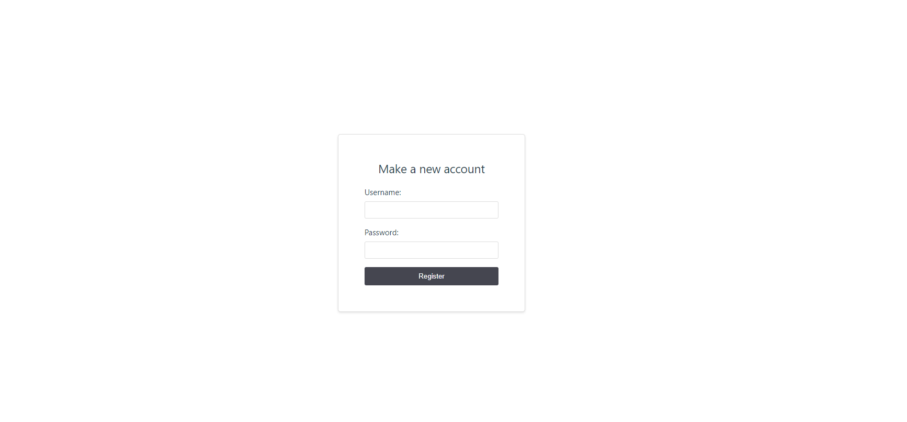
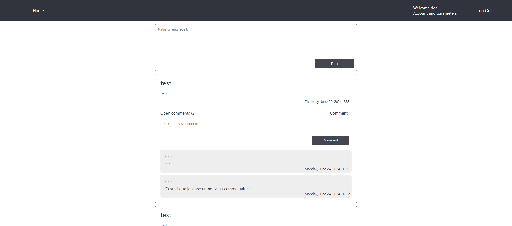

## Bienvenue sur le projet du groupe 14 ( Elwin Bassaget)

Pour l'utilisation de l'application ( Backend Graphql et Front Vue ), il suffit simplement de cloner le repo et d'effectuer un :
```
npm install
```

une fois les packages installé, lancez simplement pour les deux avec :

```
npm run dev
```

## Utilisation de l'application
Application très rudimentaire, la première page est la page de login, n'ayant pas encore de compte il suffit d'en créer un nouveau :



Puis connectez-vous, vous arriverez directement sur la page d'acceuil avec le feed des posts actuels, créer-en à volonté et regarder/commenter les différents postes ou commentaires : 



## Fonctionalitées non visibles
Entre autre les Fonctionalitées sont la vérification de la validité du token lors de requête sur l'application (Frontend). Le typage strict avec Typescript, 

# Conclusion

## Difficultés rencontrées

### Graphql
La difficulté principale était le début de l'utilisation de Graphql avec quelques zones d'ombres, après avec compris la majorité des fonctionnements ça s'est terminé plus rapidement. En particulier avec les schemas et les relations, le fait de se rendre compte qu'il faut rajouter une section.

## Temps
Malheureusement, il y'avait une manque de temps, ayant plusieurs projets à faire et à finir avant de pouvoir se concentrer sur celui-ci